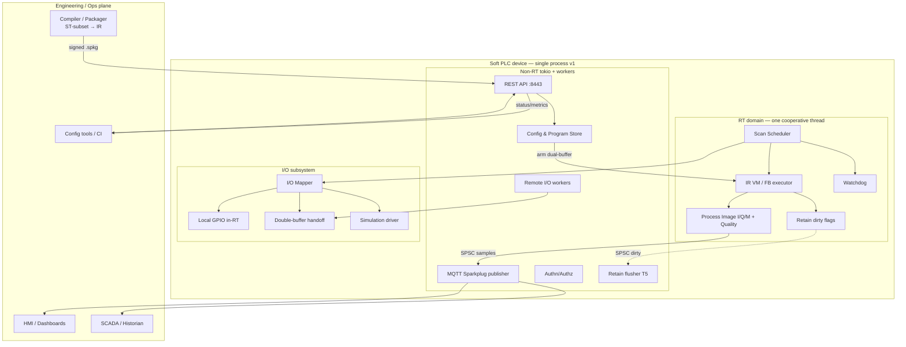
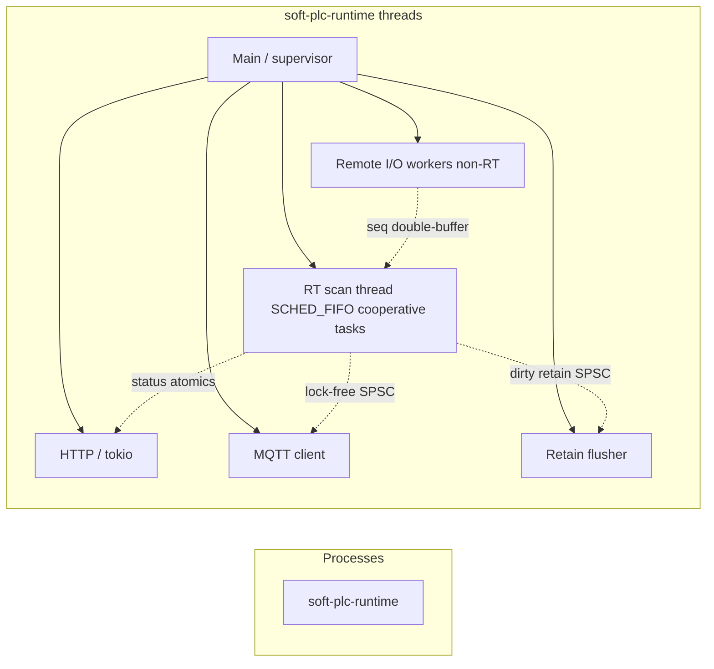
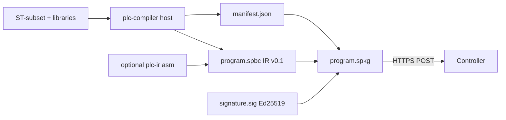
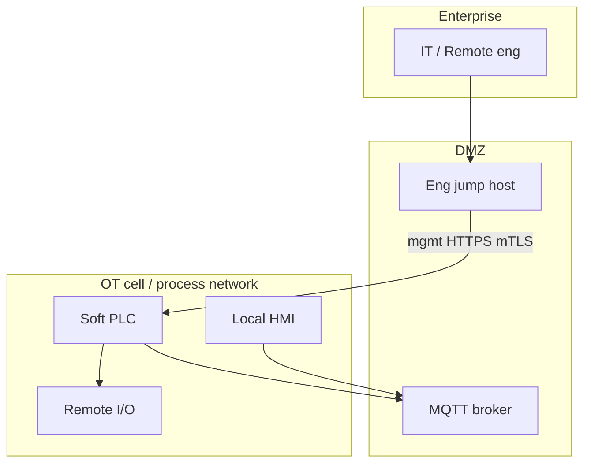

# Soft PLC Runtime for Heavy Materials Plants

| Field | Value |
|-------|-------|
| **Document** | Soft PLC Architecture Design |
| **Author** | Architecture (TBD) |
| **Date** | 2026-08-14 |
| **Status** | Draft Rev 2.2 (user product decisions incorporated) |
| **Repository** | `my-soft-plc` (this document: `docs/architecture.md`) |
| **Audience** | Senior engineers implementing the runtime and tooling interfaces |

---

## Overview

This document defines a greenfield **soft PLC runtime** and associated interfaces for controlling **heavy materials / bulk materials handling plants**—conveyors, crushers, screens, silos, weighers, stackers/reclaimers, and similar equipment. The system runs as a deterministic cyclic controller on industrial Linux (optionally `PREEMPT_RT`), exposes configuration and status over **REST**, streams process tags for HMI/dashboards, and supports **runtime download and hot-swap of logic programs** composed from **composable function-block libraries**.

The recommended stack is **Rust** for the core runtime and APIs, with **FFI isolation** for mature C fieldbus stacks where needed. Non-RT services use **tokio**. Programs are compiled offline from a **constrained Structured Text (ST) subset** to a **verified bytecode IR (IR v0.1)**, downloaded over a secured management path, validated, and switched under a **defined multi-rate epoch protocol**. I/O is a process image with **per-tag quality**, pluggable local/remote drivers, and **network I/O strictly off the RT thread**. Telemetry uses **MQTT 5 + Sparkplug B 3.0**.

---

## Background & Motivation

### Domain context

Bulk materials plants are not microsecond motion applications. Typical control needs include:

- Interlocks and sequencing (conveyor start permittives, chute blocked, belt slip, pull-cord).
- Analog process loops at modest rates (bin levels, weigh feeders, crusher amps) with **scaling and quality**.
- Mode management (local/remote, maintenance, bypass with audit).
- High availability expectations: fail-safe outputs, watchdog, clear degraded modes.
- Integration with SCADA/HMI, historians, and OEM-specific customization.

Scan cycles of **10–100 ms** are common for plant discrete/process control; **jitter budgets of a few milliseconds** are acceptable when I/O and logic complete within the cycle.

### Why a soft PLC (vs hardware PLC only)

- **Just-in-time logic** (business term: download/update without offline flash cycles during commissioning)—implemented as signed package hot-swap, **not** on-device native JIT.
- **Composable libraries**: Reuse of conveyor, crusher, and silo blocks across sites while allowing site overlays.
- **Modern ops interfaces**: First-class REST config/status and push telemetry rather than proprietary engineering tools only.
- **Deployment flexibility**: x86_64/ARM industrial PCs, edge gateways, and virtualized testbeds.

### Current state

The repository is **empty** (no source, no commits beyond git init). This design defines the architecture that implementation PRs will create.

### Pain points this design addresses

| Pain | Design response |
|------|-----------------|
| Logic only updateable offline | Hot-load with dual-buffer swap at program epoch |
| Monolithic site programs | Library + composition model for FBs (ST-subset source) |
| Driver-coupled I/O | Process image + driver trait; local and remote |
| Poll-only HMI | Streaming telemetry (MQTT Sparkplug B 3.0) |
| Unsafe dynamic code | Bytecode IR + sandbox, not native JIT / WASM / `.so` user logic |
| Industrial attack surface | Authn/authz, program signing, network zoning assumptions |

---

## Goals & Non-Goals

### Goals

1. Deterministic **cyclic scan engine** with prioritized tasks, watchdog, and retain memory.
2. **Runtime program download/update** with explicit switch rules and fail-safe behavior on load failure.
3. **Composable function-block / library model** for OEM and plant customization.
4. **I/O abstraction** supporting local GPIO/fieldbus masters and remote networked I/O, with **quality**.
5. **REST API** for configuration and status (not for high-rate process data).
6. **Push/stream data path** suitable for off-device HMI, dashboards, and SCADA gateways.
7. **Security and fail-safe** posture appropriate for industrial deployment (zoned networks, signed programs, safe I/O defaults, process-death assumptions).
8. Clear **language choice** (Rust) and initial **crate/module layout**.
9. Quantified **performance targets** for materials-plant scan rates (not servo motion).
10. Implementable **IR v0.1 contract**, task model, and hot-swap epoch without inventing policy in code review.

### Non-Goals (initial releases)

- Full IEC 61131-3 language suite (LD/FBD/SFC) compliance or PLCopen certification in v1 (ST-subset only).
- SIL-rated safety PLC / IEC 61508 certified safety core — **v1 is process-only** (see KD-15); safety I/O remains external.
- Native motion/CNC axes or sub-millisecond hard RT as a product requirement.
- Built-in full SCADA/HMI product (we provide data egress and config APIs only).
- Multi-controller distributed IEC 61499 event mesh as the primary execution model.
- Online source-level debugging IDE (engineering toolchain is out of band; runtime accepts artifacts).
- Multiple applications per device (v1: **one app / one program package** active).
- Hot standby redundancy (v1: **cold standby only**).
- On-device native JIT or WASM execution of user logic.

---

## Key Decisions

| ID | Decision | Rationale |
|----|----------|-----------|
| **KD-1** | **Language: Rust** for runtime, APIs, and IR VM; C via FFI for selected fieldbus stacks | Memory safety without GC; strong concurrency model; FFI reaches mature C drivers. See [Language Recommendation](#language-recommendation-c-c-rust). |
| **KD-2** | **Execution model: classic cyclic scan** (IEC 61131-style), not primary event-driven 61499 | Matches materials-plant mental model, SCADA expectations, and deterministic I/O image snapshot semantics. |
| **KD-3** | **Program representation: portable bytecode IR + offline AOT compiler**; **no** on-device native JIT | Predictable **WCET**, easier validation/signing, simpler safety case. See [Appendix A: IR v0.1](#appendix-a--ir-v01-contract). |
| **KD-4** | **Hot-reload: dual program buffer; activate under Program Epoch Protocol** (KD-4a) | Avoids mid-scan torn state; formal multi-rate barrier. |
| **KD-4a** | **Program epoch:** single closed program image; swap only at invocation boundaries; **finish in-flight invocation before install** (join time outside CS); install CS deadline ≤ min_task_period starting when install begins; arm-time shadow retain; **missed deadline → defer**, not FAULT | Eliminates torn multi-version execution; avoids counting Normal WCET against Fast-period install budget. |
| **KD-5** | **I/O: process image (I/Q/M/R) + quality plane + pluggable drivers** | Decouples scan from transport; logic can gate on sensor health. |
| **KD-5a** | **Network / remote I/O only on non-RT workers**; RT copies sequence-numbered double buffers at I/Q phases; local GPIO may run in-RT if WCET-measured | Protects 10–20 ms Fast budgets from TCP retransmit. |
| **KD-6** | **Config/status: REST over HTTPS** (OpenAPI-described) | Simple for tools/ops; not used for cyclic process data. |
| **KD-7** | **Telemetry: MQTT 5 + Sparkplug B 3.0** primary; OPC UA optional Phase 2 | Efficient pub/sub; industrial metric model. |
| **KD-8** | **Deploy on Linux with optional PREEMPT_RT**; isolate RT scan thread | Soft real-time sufficient for 10–100 ms plant scans. |
| **KD-9** | **Programs must be signed** (Ed25519); controller verifies before arm | Mitigates unauthorized logic injection. |
| **KD-10** | **Monorepo workspace** (`crates/*`); single process v1 with process-death fail-safe assumptions | Deployment simplicity; external I/O heartbeat for crash safety. |
| **KD-11** | **Cooperative multi-tasking on one RT thread**; no mid-FB / mid-invocation preemption; priority = rate-monotonic schedule order | Shared `%M`/FB instances without races; matches single RT-thread diagram. |
| **KD-12** | **v1 engineering language: constrained ST-subset** (text), allowlist in Appendix B; FBD later; Rust only for built-in primitives | Unblocks compiler/libs; bounds PR-15 scope. |
| **KD-13** | **Non-RT async runtime: tokio** (HTTP, MQTT, remote I/O workers, retain flusher). **Forbidden on RT path** | Clear split; CI enforces no tokio/alloc in scan crates. |
| **KD-14** | **v1: one application / one active program package per device** | Avoid multi-app isolation complexity. |
| **KD-15** | **v1 marketed as process control only** (not SIL/safety PLC); cold standby only (no hot standby) | Honest safety boundary; simpler availability story. |
| **KD-16** | **Timers use monotonic clock** (`clock_gettime(CLOCK_MONOTONIC)`) sampled once per task invocation; `TIME` resolution **1 ms** | Correct after overruns; immune to NTP step. |
| **KD-17** | **Activate state machine:** operator `mode` ∈ {STOP, RUN, FAULT, SIM}; separate `program.phase` ∈ {idle, validating, armed, swapping}; validation failures never enter FAULT | Clear ops UX; no conflation of LOAD with FAULT. |
| **KD-18** | **License: Apache-2.0** for the open-source core | Permissive; widely accepted for industrial OSS and commercial derivatives; declare in root `LICENSE` from PR-01 |
| **KD-19** | **Telemetry timestamp timebase: NTP / system clock only in v1**; stamp quality **Uncertain** when not synchronized; **no PTP dependency** for pilot | Sufficient for materials-plant dashboards; avoids PTP stack on pilot hardware |
| **KD-20** | **Pilot field I/O: sim + GPIO + Modbus TCP only**; EtherCAT / PROFINET deferred to customer-driven later phases | Matches bulk of materials-plant instruments/I/O; keeps v1 FFI surface small |
| **KD-21** | **v1 off-device visuals: MQTT Sparkplug B 3.0 only** — **no WebSocket** server in v1 | Aligns with KD-7; one egress path for PR-13; browsers use broker/Web HMI in front of MQTT |
| **KD-22** | **Reference hardware: x86_64 industrial PC / NUC first** | Straightforward PREEMPT_RT; strong for SIM + Modbus pilots and engineering desktops |
| **KD-23** | **Retain without UPS: accept last-fsync dirty window**; document risk; recommend UPS/supercap in deployment guide — **not** a hard product requirement | Honest availability story; avoids blocking pilots on specialized power hardware |

---

## Language Recommendation (C / C++ / Rust)

### Comparison for this domain

| Criterion | C | C++ | Rust |
|-----------|----|-----|------|
| **Real-time determinism** | Excellent; full control, no hidden runtime | Excellent if avoid exceptions/alloc in RT paths | Excellent if bounded alloc in RT paths; need discipline (see RT rules) |
| **Memory safety** | Manual; UAF/overflow class bugs common in long-lived PLC code | Better with RAII/smart pointers; still easy to share mutable state unsafely | Strong default; `unsafe` isolated at FFI/driver boundaries |
| **Industrial protocol ecosystem** | Strongest (most fieldbus stacks are C) | Good wrappers over C | Growing; **FFI to C stacks** is the pragmatic path |
| **FFI to fieldbus** | Native | Excellent | Excellent via `bindgen`/`cc`; cost is `unsafe` surface |
| **Concurrency** | pthreads; data races on programmer | Threads + atomics; races still common | Ownership + `Send`/`Sync` catches many races at compile time |
| **Team / long-term maintainability** | Large pool; high review cost for safety | Large pool; complexity of modern C++ dialects | Smaller industrial/OT pool today; higher onboarding, fewer class of prod bugs |
| **Tooling / CI** | Mature | Mature | Excellent `cargo`, miri, clippy for quality bar |
| **Hot-reload / IR VM** | DIY | DIY | Strong for safe interpreters and capability-limited VMs |

### Recommendation

**Choose Rust** as the implementation language for:

1. Core scan engine, IR virtual machine, retain store, REST, MQTT egress, config store.
2. Library/component metadata and composition validation.
3. Integration tests and simulation drivers.

**Use C (via FFI)** only where unavoidable:

- Vendor fieldbus master libraries (e.g., selected EtherCAT, Modbus RTU helpers if not pure-Rust).
- Existing certified stacks if adopted later.
- Optional **C header / ABI** for external driver writers who will not touch Rust RT code.

**Do not use C++ as the primary language** for this greenfield: it does not win clearly on safety vs Rust or on industrial stack access vs C.

### RT coding rules (Rust)

- Scan path: pre-allocated buffers, no unbounded lock waits, no blocking I/O on RT thread.
- Network and disk only on non-RT threads (tokio workers + retain flusher).
- **Per-scan allocation forbidden after first entry to `RUN`**; cold path only in `STOP` / validate / arm.
- **No tokio, no default allocator freelist churn assumptions on RT path** — scan crates use explicit arenas allocated at arm time.
- CI: clippy + custom lint/deny for `plc-scan` / `plc-vm` importing `tokio`, `std::fs`, or network crates.
- **Drop glue discipline:** no types with complex `Drop` that free heap on RT path; prefer `Copy` state and arena-bump instance data.
- **Locks:** RT may only touch lock-free SPSC / atomics toward non-RT; never `Mutex` that non-RT can hold during I/O.
- **`unsafe` review policy:** all `unsafe` confined to `plc-io-*/ffi` and explicitly allowlisted modules; IR verifier and package parser stay safe Rust; miri on non-RT tests; fuzz `plc-ir` verifier and package parser.

### Non-RT stack (KD-13)

- **tokio** multi-thread runtime for REST (axum), MQTT client, Modbus TCP polls, retain flusher coordination.
- Separate OS thread for RT scan (not a tokio task).

---

## Proposed Design

### High-level architecture



### Process and thread model



- **One primary process** initially (`soft-plc-runtime`) to reduce deployment complexity.
- **RT scan thread**: `SCHED_FIFO` when permitted; pinned CPU optional via config; **cooperative** multi-task (KD-11).
- **Remote I/O workers (T2):** non-RT; fill input back-buffer; never block T1.
- **Lock-free queues** from RT → non-RT for telemetry samples, retain-dirty commands, and event counters.
- **Never** call into HTTP, TLS, MQTT, or network I/O from the scan thread.

#### Process-death fail-safe (v1 assumptions)

Userspace crash or `kill -9` of `soft-plc-runtime` **must not** leave field actuators energized by software hope alone:

| Layer | v1 requirement |
|-------|----------------|
| **Remote I/O modules** | Must de-energize outputs on **loss of master heartbeat / TCP session** (module/vendor feature or explicit “watchdog register” written by driver each poll). Document as deployment prerequisite for production. |
| **Local GPIO** | Drivers configure lines inactive on process exit where the kernel/driver supports it; prefer open-drain / de-energize-on-float hardware. systemd unit: `ExecStop=` best-effort safe write is **not sufficient** alone. |
| **systemd** | `WatchdogSec=` + `Restart=`; Type=notify; process strokes systemd watchdog from **successful scan path** (same as HW WD policy). |
| **Hardware watchdog** | `/dev/watchdog` stroked only after successful scan completion while not in unrecoverable panic; see [Watchdog](#watchdog). |
| **Phase 2** | Optional **I/O proxy process** with smaller TCB and independent heartbeat, so REST/MQTT memory bugs cannot corrupt driver address space. Not required for first SIM/pilot, **planned** before high-risk plant sections. |

**Risk:** userspace crash leaves outputs undefined **without** external module heartbeat / hardware fail-safe. This is an explicit deployment constraint, not an afterthought.

### Cyclic scan engine

#### Task model (cooperative, one RT thread)

| Task class | Typical period | Priority (schedule order) | Use |
|------------|----------------|---------------------------|-----|
| **Fast** | 10–20 ms | Highest | Interlocks, E-stop chain mirror, critical conveyors |
| **Normal** | 50–100 ms | Medium | Sequencing, most plant logic |
| **Slow** | 200–1000 ms | Lower | Averaging, reports, non-critical analogs |
| **Background** | free time / ~1 s | Lowest | Diagnostics **signals only** (no NV I/O) |

**KD-11 — Cooperative multi-tasking (normative):**

1. **Single RT thread** runs all cyclic tasks.
2. When multiple tasks are due, run **highest priority first** (rate-monotonic).
3. A task **runs to completion** of one invocation (full Input→Logic→Output for that task’s entry). **No preemption mid-FB or mid-instruction.**
4. Lower-priority work is **delayed**, never half-executed.
5. **One closed program package** defines entry points `task.fast`, `task.main`, `task.slow` (names configurable) sharing one image and one instance arena.
6. **Shared state:** `%I`, `%Q`, `%M`, retain, and FB instances are **global to the program**. Application authors must treat multi-rate access like classic PLC global DBs—document in coding standard: Fast may set interlock bits; Normal reads them; avoid dual writers to same `%M` without agreed ownership.
7. **Disjoint instance pools per task are not required** in v1; compiler may warn on FB instances written by multiple tasks.

#### Input sampling policy

| Region | When updated |
|--------|----------------|
| **Local GPIO inputs** | At **start of each task invocation** that is configured to sample local I (default: every task). |
| **Remote inputs** | RT **copies** the latest published double-buffer snapshot (with sequence number + quality) at start of each task invocation—**does not** block on network. Typical freshness: 0–1 remote poll period lag. |
| **Outputs** | Written at **end of each task** that owns them; mapper merges to output front-buffer. Last writer wins if two tasks write same `%Q` (compiler warning; avoid). |

#### Performance targets (materials plants)

| Metric | Target |
|--------|--------|
| Default continuous task period | **50 ms** |
| Fast task period | **10–20 ms** |
| Max consecutive **logic** overruns before FAULT | **2** (configurable); I/O degraded ≠ automatic FAULT |
| RT jitter (PREEMPT_RT, isolated core) | **p99 < 2 ms** for 50 ms task |
| Logic budget per 50 ms task | ≤ **30 ms WCET** (worst-case execution time of scan logic; leave margin for local I/O copy) |
| Local digital I/O update | within same task invocation |
| Remote I/O | **1-scan (or 1-poll) delay default**; quality reflects staleness |
| Tag publish rate (telemetry) | 100 ms–1 s decimated; CoS for digitals |

#### Scan sequence (per task invocation)

```mermaid
sequenceDiagram
  participant WD as Watchdog
  participant SCH as Scheduler
  participant DB as Remote I/O double-buffer
  participant IO as I/O Mapper
  participant VM as IR VM
  participant TEL as Telemetry SPSC
  participant RET as Retain dirty SPSC

  SCH->>WD: mark scan start
  SCH->>DB: atomic swap/read latest input snapshot + seq + quality
  SCH->>IO: merge local GPIO read + remote snapshot → %I / quality
  SCH->>VM: execute task entry (monotonic now_ms captured once)
  VM->>VM: evaluate FBs / networks
  SCH->>IO: merge %Q + force overlay → output front-buffer
  SCH->>IO: write local GPIO; publish output snapshot to remote worker
  SCH->>TEL: enqueue dirty tags / samples
  SCH->>RET: enqueue retain-dirty if any
  SCH->>WD: mark scan end / stroke on success
  Note over SCH: clock_nanosleep until next due task
```

Classic PLC order: **Input → Logic → Output**. No immediate physical I/O FB in v1 (image-only).

#### Watchdog

**Software watchdog (logic overrun):**

- If a task invocation duration exceeds `period × overrun_limit` (default limit = 2 consecutive overruns for that task), transition to **FAULT**, force outputs to **safe_state**.
- **I/O degraded** (remote timeout, quality Bad) **does not** by itself enter FAULT; it sets module/tag quality and applies **mapper force_safe policy** for that module’s outputs. Optional config `io.fault_on_module_bad: true` for hard plants.

**Hardware watchdog (`/dev/watchdog`):**

- Stroked only from **successful scan completion** path while mode ∈ {RUN, SIM, STOP, FAULT}.
- **In FAULT:** continue stroking HW WD **while** safe outputs are held and supervisor is healthy—so prolonged FAULT awaiting operator **does not** reboot by default.
- **Panic / RT thread death:** stop stroking → platform reboot → external I/O heartbeat loss de-energizes field.
- systemd `WatchdogSec` aligned with same policy.

#### Operating modes and program phase (KD-17)

**Operator-visible `mode`** (mutually exclusive control modes):

| Mode | Behavior |
|------|----------|
| `STOP` | Logic not executed; outputs **safe_state** by default (config: `stop_output_policy: safe \| hold`—default **safe**) |
| `RUN` | Cyclic cooperative execution |
| `FAULT` | Safe outputs; requires `FAULT_RESET` then explicit `RUN` |
| `SIM` | Logic runs; `sim` driver only (no field writes) |

**`program.phase`** (orthogonal to mode; never replaces mode):

| Phase | Meaning |
|-------|---------|
| `idle` | No pending package operation |
| `validating` | Upload accepted; signature/IR/retain checks running (non-RT) |
| `armed` | Buffer B ready; waiting for `activate` |
| `swapping` | Epoch critical section in progress or scheduled |

There is **no** operator mode named `LOAD`. Validation/arming can occur while `mode=RUN` (old program keeps running) or `STOP`.

### Program download and hot-swap

#### Artifact pipeline



**Package (`program.spkg`)** — binary container:

| Field | Content |
|-------|---------|
| Magic | `SPKG` (4 bytes) + version `u16` (=1) |
| Manifest | **JSON only (v1)** — `u32` little-endian length prefix, then UTF-8 JSON object (see below). CBOR is **not** accepted in package major 1; deferred to a future package major if needed. |
| Bytecode | one or more `spbc` sections (see Appendix A) |
| Signature | Ed25519 over SHA-256 of (`manifest_canonical` \|\| bytecode blob(s) in package order) |

**Manifest JSON fields (normative keys):** `id`, `version` (semver string), `build_id`, `ir_major`, `ir_minor`, `primitive_abi`, `task_entries` (name → entry symbol), `retain_symbols` (name+type sorted for hash), `tag_dictionary`, `restart_policy` (`safe_reset` \| `bumpless`), `compatibility_hash` (hex), optional image sizing if not only in `spbc` (must match `spbc` header when both present).

**There is no separate `bumpless` boolean.** Use `restart_policy` only.

**`manifest_canonical` for Ed25519 preimage (v1):**
1. Parse JSON; reject duplicate keys, comments, and non-UTF-8.
2. Re-serialize with **RFC 8785 JSON Canonicalization Scheme (JCS)** (sorted object keys, no insignificant whitespace, number formatting per JCS).
3. Hash = SHA-256(`manifest_canonical_bytes` \|\| `bytecode_bytes`).

Max package size: **8 MiB** (reject larger uploads).

#### Why bytecode (not source-on-device, not native JIT, not WASM)

| Option | Pros | Cons | Verdict |
|--------|------|------|---------|
| Interpret source on device | Simple download | Slow, large parser, hard WCET | Reject |
| Native JIT/AOT on device | Fast | Complex, hard to certify, attack surface | Reject v1 |
| Offline native `.so` plugins | Fastest | ABI hell, RCE | Reject for user logic |
| **WASM sandbox** | Ecosystem, bounds checks | WCET hard with engines; JIT often on; host ABI surface; less PLC-native types | **Defer** (A9) |
| **MatIEC / OpenPLC core** | Faster ST path | Weak control of hot-swap/signing/quality model; C debt | **Reject as core** (A8); may inspire ST grammar |
| **Offline AOT → custom bytecode VM** | Bounded ops, signable, portable PLC ops | Interpreter overhead | **Adopt** |

VM design goals (normative details in Appendix A):

- Fixed-width 32-bit instruction words (IR v0.1).
- Stack machine with max depth **256** values (verifier-enforced).
- **No dynamic allocation** during `RUN` in the interpreter hot loop.
- FB instances in pre-sized data + retain segments.
- Max call depth **32**; no recursion allowed by verifier for user FBs.

#### Program epoch protocol (KD-4a) — multi-rate hot-swap

```mermaid
stateDiagram-v2
  [*] --> Idle
  Idle --> Validating: POST /programs upload
  Validating --> Armed: checks pass
  Validating --> Idle: checks fail (stay prior program; no FAULT)
  Armed --> Idle: disarm / new upload replaces arm
  Armed --> Swapping: POST activate accepted
  Swapping --> Idle: success — new program current
  Swapping --> Idle: deferred — deadline miss; remain Armed
  Swapping --> FAULT: swap corruption / invariant fail only
```



**Normative rules:**

1. **Single program image:** all task entry points live in one package; there is never “Fast on v2 + Slow on v1.”
2. **Upload** → non-RT validate (signature, IR verify, limits, retain report) → **armed** buffer B. Old program keeps running if `mode=RUN`.
3. **Activate** requests a swap. Scheduling is **invocation-boundary only** (never mid-invocation under KD-11):
   1. **Wait for quiet point:** do **not** begin install while any task invocation is in progress. If a lower-priority task is mid-invocation when activate is requested (e.g. Normal overran into Fast’s nominal slot), **finish that invocation first** (cooperative run-to-completion). This join/finish time is **outside** the critical-section deadline and is normal scan work on the **old** program.
   2. **Skip rule:** after a successful install decision, any lower-priority task that was due but had not yet started on old bytecode **skips one** pending due tick (does not start on old code after the swap decision).
   3. At the **next highest-priority task boundary** (when Fast would start—or Normal if no Fast—and no invocation is in flight), set `program.phase=swapping`.
   4. **Output policy during install CS:** **hold last `%Q`** (do not flap `safe_state` on the success path).
   5. **Critical-section deadline** applies only to **install work**, starting when install begins (after step 1 completes):
      - **deadline = min_task_period** wall-clock (default Fast period, e.g. 20 ms).
      - Work: install precomputed retain image (see arm-time prep); cold-init non-retain / `%M` if not pre-cleared; pointer-swing buffer B → current; reset VM entry PCs; arm **per-task first-scan bits**; apply output `restart_policy`.
   6. **Arm-time precomputation (required for large retains):** while `phase=validating`/`armed` (non-RT), build a **shadow retain image** and cold-init plan for buffer B so RT critical section is primarily **pointer-swing + bounded memcpy**, not full symbol walks. If arm cannot precompute within resource limits → reject arm (not FAULT).
   7. **If install exceeds deadline:** abort install, remain on old program, `phase=armed`, diagnostic `activate_deferred`; **do not FAULT**. Client may retry activate.
   8. **If invariant failure** (checksum fail mid-install, buffer overflow): apply **safe_state**, enter **FAULT**, keep metadata for forensics. Validation failures **never** take this path.
4. **Validation failure:** HTTP 4xx, `phase=idle`, prior program untouched, mode unchanged.
5. **Only one armed buffer.** New successful upload while `armed` **replaces** the armed package (explicit). Upload while `swapping` → **409 Conflict**.
6. **Not supported in v1:** mid-scan rung patch; multi-package multi-app; switching only a subset of tasks.

#### Hot-swap state policy table (normative)

| State class | On successful activate | Notes |
|-------------|------------------------|-------|
| **`VAR_RETAIN` / `%R`** | Symbol-path map; same path + compatible type → keep value; new → cold default; missing in new → drop | Incompatible type → **reject at arm** unless `force_retain_incompat=true` (zeros those slots, audit). Shadow image built at arm (non-RT). |
| **Non-retain FB state** (TON elapsed, RS/SR Q, PID integrator, CTU.CV if non-retain) | **Cold init always** | Avoids warm garbage after layout change |
| **`%M` volatile** | **Cold init (zero)** | |
| **`%Q` outputs** | Per **`restart_policy` only** (no separate `bumpless` flag) | `safe_reset` (default): force `safe_state` for one logic pass then program drives. `bumpless`: **hold last `%Q`** through each task’s first post-activate invocation **iff** `compatibility_hash` matches running program; else treat as `safe_reset` and reject bumpless eligibility at arm (warn). |
| **`SYSTEM.FirstScan` (per-task)** | See [First-scan semantics](#first-scan-semantics-normative) | **Not** a global flag held until Slow runs |
| **Timers across arm wait** | Old program continues with monotonic time while armed; new program timers start cold after activate | Long arm periods do not “pause” old timers |
| **`restart_policy`** | Manifest field: `safe_reset` (default) \| `bumpless` | **Single field** — do not emit a parallel boolean. Semver major is advisory only; **`compatibility_hash`** gates whether `bumpless` is honored |
| **`compatibility_hash`** | Hash of: IR major, primitive ABI, sorted retain symbol table (name+type), sorted `%Q` tag set+types, task entry names | Compiler computes; runtime compares |

#### First-scan semantics (normative)

Classic multi-rate PLC behavior: **each task entry** gets a one-shot first-invocation pulse after a cold RUN entry or successful activate—**independent** of slower tasks.

| Rule | Detail |
|------|--------|
| **Storage** | Runtime keeps a **per-task** bit `first_scan[task_id]` (not one global sticky flag). |
| **`SYSTEM.FirstScan` visibility** | During task *T*’s invocation, `SYSTEM.FirstScan` reads as `first_scan[T]`. Other tasks’ bits are irrelevant to *T*. |
| **Set true** | On successful activate (all task bits set); on cold boot into RUN with loaded program; **not** on mere STOP→RUN with same program (see timers). |
| **Clear false** | At **end** of that task’s first completed invocation (after its entry `HALT`), clear `first_scan[T]` only. |
| **Multi-rate hazard avoided** | Fast must **not** observe `FirstScan=true` for many cycles waiting for Slow. After Fast’s first post-activate run, Fast sees `false` even if Slow has not run yet. |
| **Terminology** | Do **not** call this a “program epoch.” Program epoch (KD-4a) is only the hot-swap install barrier. |

Optional convenience (same semantics): compiler may also expose `SYSTEM.FirstScan_<TaskName>` as distinct BOOLs; runtime still implements per-task bits.

**PR-10 must include tests** for: timer reset on activate, PID cold integrator, retain keep/reject, `restart_policy` bumpless hold vs safe_reset, activate_deferred on injected slow install, **FirstScan multi-rate** (Fast runs ≥2 times with `FirstScan=false` before Slow’s first post-activate invocation completes), and STOP→RUN timer preserve.

### Component / library model (composable function blocks)

#### Concepts

- **Primitive FBs**: built into runtime in Rust (TON, TOF, TP, CTU, CTD, RS/SR, PID, edge detect, etc.)—**not** user-downloadable native code.
- **Library FBs**: composed offline from primitives and other library FBs in **ST-subset**; shipped as IR inside the closed app package.
- **Application**: instances of FBs assigned to task entries.

#### Composition rules

- Libraries declare **semver** and **ABI hash** of dependency set.
- Application build **statically binds** library IR so controller receives a **closed package**.
- Runtime only needs: primitive set version + closed package.
- OEM customization: publish libraries to the **compiler**, not as native code on the controller.
- Source language surface is the **ST-subset allowlist** in [Appendix B](#appendix-b--st-subset-allowlist-v1); PR-15 acceptance is against that list only.

#### Example plant-level FB (ST-subset shape)

```text
FUNCTION_BLOCK ConveyorDrive
  VAR_INPUT
    i_StartCmd      : BOOL;
    i_StopCmd       : BOOL;
    i_PullCordOK    : BOOL;
    i_BeltSlipOK    : BOOL;
    i_ChuteBlocked  : BOOL;
    i_LocalMode     : BOOL;
  END_VAR
  VAR_OUTPUT
    o_RunFwd        : BOOL;
    o_Fault         : BOOL;
    o_Ready         : BOOL;
  END_VAR
  VAR_RETAIN
    r_RunHours      : REAL;
  END_VAR
  (* body: TON interlocks, RS latch, hour accumulator *)
END_FUNCTION_BLOCK
```

### I/O subsystem

#### Process image and quality plane

| Region | Direction | Persistence | Notes |
|--------|-----------|-------------|-------|
| `%I` | Inputs | Volatile | Snapshot at task start (local + remote copy) |
| `%Q` | Outputs | Volatile | End of task; safe on FAULT |
| `%M` | Memory | Volatile | Working state; cold on activate |
| `%R` / retain | Retained | NV | Symbolic map |
| **Quality** | Side plane | Volatile | Per-tag: `Good=0`, `Uncertain=1`, `Bad=2` (u8) |

**Quality (normative):**

- Mapper maintains `quality[tag]` updated every input publish.
- **Bad:** communication loss, explicit driver fault, or age > `stale_ms` (per module, default `3 × poll_ms`).
- **Uncertain:** non-fatal driver warning (e.g. degraded sensor).
- Auto-generated BOOL tags (optional, default on): `q_<TagName>_good` visible to logic as `%I` bindings.
- Raw quality also readable via system tags `SYSTEM.Quality.<ModuleId>`.
- On **Bad** for an output module: mapper applies `force_safe` for that module’s `%Q` (policy `on_bad_quality: force_safe | hold_last`, default **force_safe**), audited in diagnostics.
- Logic **must** be able to gate on quality (materials plants: belt scale, level radar). Simulation driver can inject quality for tests.
- Sparkplug metrics include quality property (Sparkplug metric quality field).

#### Mapper (YAML) — scaling and bindings

```yaml
# illustrative io-map.yaml
version: 1
modules:
  - id: local_di_1
    driver: gpio
    config: { chip: gpiochip0, lines: [0, 1, 2, 3] }
    bindings:
      - tag: Conveyor1.PullCordOK
        image: I
        bit: 0
  - id: remote_rack_a
    driver: modbus_tcp
    config:
      endpoint: "192.168.10.20:502"
      unit: 1
      poll_ms: 50
      stale_ms: 150
    on_bad_quality: force_safe
    bindings:
      - tag: Silo1.Level_eu
        image: I
        type: REAL
        register: 40001
        register_type: holding
        raw_type: INT
        scale: 0.1          # eng = raw * scale + offset
        offset: 0.0
        clamp: [0.0, 100.0]
        unit: "pct"
  - id: local_do_1
    driver: gpio
    config: { chip: gpiochip1, lines: [0, 1] }
    bindings:
      - tag: Conveyor1.RunFwd
        image: Q
        bit: 0
        safe_state: false
```

#### Write / force priority (normative)

For each output channel, effective value is:

1. **If mode FAULT or global force_safe:** `safe_state`
2. **Else if maintenance force overlay active for tag:** forced value (REST `PUT /tags/{name}` with `force: true`)
3. **Else if module quality Bad and policy force_safe:** `safe_state`
4. **Else:** program `%Q` from last task write
5. **Else (never written):** `safe_state`

Force overlays are **cleared** on `STOP`, `FAULT`, and `FAULT_RESET`. Forces are audited and published on MQTT with a `Forced` metadata flag.

Maintenance/bypass **process** interlocks (e.g. chute blocked bypass) are **library FB concerns** with retain + audit bits—not silent runtime features.

#### Drivers (trait)

```rust
/// Conceptual interface (`plc-io`)
pub trait IoDriver: Send {
    fn name(&self) -> &str;
    fn start(&mut self) -> Result<(), IoError>;
    fn stop(&mut self);
    /// Non-RT or in-RT per driver class; fill InputUpdate { values, quality, seq }.
    fn poll_inputs(&mut self, out: &mut InputUpdate) -> Result<(), IoError>;
    /// Apply outputs; must honor force_safe / safe_state.
    fn apply_outputs(&mut self, image: &OutputImage, force_safe: bool) -> Result<(), IoError>;
    fn diagnostics(&self) -> DriverDiag;
}
```

**Driver placement (KD-5a):**

| Driver | Thread | Notes |
|--------|--------|-------|
| `sim` | Either | CI/desktop |
| `gpio` | **RT allowed** | WCET measured; no heap; ioctl bounded |
| `modbus_tcp` | **Non-RT worker only** | Double-buffer handoff; 1-poll delay default; **only pilot fieldbus (KD-20)** |

No EtherCAT/PROFINET drivers in pilot scope; add only when a customer program requires them.

**Double-buffer handoff:**

- Worker writes back-buffer + `seq` + per-tag quality; atomic publish pointer.
- RT reads front snapshot at Input phase; never waits on socket.
- RT publishes output snapshot; worker sends on its schedule.
- Torn reads prevented by seq odd/even or double-buffer swap with seq check (retry copy if seq changes mid-memcpy—bounded retries).

### Memory model & retain

- **Cold start:** zeros / configured initials; retain loaded from NV.
- **Warm start (power cycle, same program):** retain restored; non-retain cleared.
- **Hot program activate:** see [Hot-swap state policy table](#hot-swap-state-policy-table-normative).
- **NV backend:** double-buffered file on industrial disk/eMMC; checksum header.
- **Who writes NV:** RT sets **dirty flags** and enqueues retain pages via SPSC; **T5 Retain flusher** performs encode + `fsync`. Background task class does **not** perform NV I/O (signal-only diagnostics).
- **Hold-up (KD-23):** Accept **last-fsync dirty window** on sudden power loss without UPS/supercap. On graceful shutdown, request T5 flush. Deployment guide **recommends** UPS or supercap for plants that cannot tolerate retain loss; **not** a hard runtime requirement. Document expected dirty-window (last dirty retain pages not yet fsynced).

### Timer / timebase semantics (KD-16)

| Topic | v1 rule |
|-------|---------|
| Clock source | `CLOCK_MONOTONIC` (Linux); never wall clock for TON/TOF/TP |
| Sample time | `now_ms: u64` captured **once** at start of each task invocation; all FBs in that invocation see the same `now_ms` |
| `TIME` type | signed 32-bit **milliseconds** (`TIME#1s` = 1000); max ~24.8 days single duration |
| TON/TOF/TP | store `start_ms` / accumulate using `now_ms`; **not** “assume period elapsed” |
| Overrun / skip | Timers advance by real monotonic delta → long pause (debugger, defer) expires timers correctly |
| **STOP → RUN (same program, no activate)** | Logic does not execute in STOP; timer **instance data is preserved** (frozen). On RUN, timers resume from preserved `ET`/`start_ms`/`Q` using new monotonic samples—**not** cold-reset. **Do not** set per-task FirstScan bits on this transition. |
| **FAULT → RUN** | After `FAULT_RESET` + `RUN`, same as STOP→RUN for timer instance data **unless** the fault handler policy zeroes non-retain (default: **preserve** instance data; outputs still went safe while in FAULT). |
| **Activate / cold boot** | Non-retain timer state **cold-init** (zero); FirstScan bits set per [First-scan semantics](#first-scan-semantics-normative). |
| **Power-cycle warm start** | Retain restored from NV; non-retain (including non-retain timers) cold; then RUN. |
| Telemetry wall stamps (KD-19) | Sparkplug / event timestamps use **system clock (NTP-disciplined)**. If clock is unsynchronized (e.g. chrony/ntp not locked, or large step residual), set timestamp / metric quality **Uncertain**. **No PTP client required in v1.** Wall clock **must not** feed TON/TOF/TP (monotonic only). |

### REST API (configuration & status)

Base: `https://<device>:8443/api/v1`  
Auth: mTLS and/or bearer tokens.  
Content-Type: `application/json` unless package upload.

#### Operational limits (frozen defaults)

| Limit | Value |
|-------|-------|
| Max `.spkg` upload size | **8 MiB** |
| Upload timeout | **60 s** |
| Concurrent uploads | **1** (second → 429) |
| Arm/activate in flight | **1** armed package |
| REST rate limit (auth’d) | **30 req/s** sustained, burst 60; auth failures **5/min/IP** then 60 s lockout |
| `GET /tags` fan-out | Not for HMI; max 100 forced tag ops/min |
| Activate wait | Async default (below) |

#### Resource sketch

| Method | Path | Purpose |
|--------|------|---------|
| `GET` | `/health` | Liveness (ops VLAN policy) |
| `GET` | `/status` | `mode`, `program.phase`, scan stats, program ids, faults |
| `GET` | `/status/tasks` | Per-task period, last/max µs, overruns |
| `GET` | `/status/io` | Driver health, module quality, seq lag |
| `GET` | `/config` | Non-secret config (secrets redacted) |
| `PUT`/`PATCH` | `/config` | Update (may require STOP) |
| `GET` | `/programs` | Stored programs |
| `POST` | `/programs` | Upload `.spkg` (raw body or multipart) |
| `GET` | `/programs/{id}` | Metadata + retain compatibility report if armed |
| `POST` | `/programs/{id}/arm` | Validate & arm (**idempotent** if same id+hash already armed → 200) |
| `POST` | `/programs/{id}/activate` | Request epoch swap |
| `DELETE` | `/programs/{id}` | Remove inactive (not current/armed) |
| `POST` | `/mode` | `{ "mode": "RUN" \| "STOP" \| "FAULT_RESET" \| "SIM" }` |
| `GET` | `/tags` | Dictionary |
| `GET` | `/tags/{name}` | Debug read |
| `PUT` | `/tags/{name}` | Force write if permitted |
| `GET` | `/metrics` | Prometheus |
| `GET` | `/diagnostics/events` | Ring buffer |
| `GET` | `/diagnostics/audit` | Audit export (paged) |

#### Activate / arm concurrency

- **Arm:** synchronous HTTP (validate may take seconds); returns 200 armed or 4xx; sets `program.phase`.
- **Activate:** returns **`202 Accepted`** with `{ "job_id", "status": "pending" }`; client polls `GET /status` until `phase=idle` and `program.id` updated, or `activate_deferred` / FAULT events. Optional query `?wait_ms=5000` blocks up to timeout then 200/202.
- **Idempotency:** `activate` while already current id+hash → 200 no-op; while `swapping` → 409; while not armed → 409.
- **Mode during armed:** `POST /mode RUN|STOP` allowed; `SIM` only from STOP. Mode change during `swapping` → 409.
- **FAULT_RESET** during swapping → 409.

**Illustrative status payload:**

```json
{
  "mode": "RUN",
  "program": {
    "phase": "armed",
    "current": {
      "id": "plant-line-a",
      "version": "1.4.2",
      "build_id": "2026-08-14T12:00:00Z-abcd",
      "compatibility_hash": "a1b2…",
      "signed": true
    },
    "armed": {
      "id": "plant-line-a",
      "version": "1.5.0",
      "build_id": "2026-08-14T18:00:00Z-ef01",
      "compatibility_hash": "c3d4…",
      "restart_policy": "safe_reset",
      "bumpless_eligible": false
    }
  },
  "scan": {
    "tasks": [
      { "name": "fast", "period_ms": 20, "last_us": 4120, "max_us": 8900, "overruns": 0 },
      { "name": "main", "period_ms": 50, "last_us": 12100, "max_us": 22000, "overruns": 0 }
    ]
  },
  "watchdog": "ok",
  "io": { "degraded": false, "modules_bad": [] },
  "uptime_s": 86400
}
```

### Data egress for visuals / HMI

#### Options compared

| Technology | Strengths | Weaknesses | Fit |
|------------|-----------|------------|-----|
| REST polling | Simple | Inefficient | Config only |
| WebSocket | Easy browser HMI | Custom OT schema | **Out of v1** (KD-21); revisit post-pilot |
| **MQTT 5 + Sparkplug B 3.0** | Birth/death, metrics, brokers | Needs broker | **Only v1 egress** (KD-7, KD-21) |
| OPC UA | SCADA ubiquity | Heavier on device | Phase 2 / gateway |
| gRPC | Efficient | Weak HMI ecosystem | Internal only |

#### Sparkplug B contract (v1 frozen defaults)

| Item | Value |
|------|-------|
| Spec | **Eclipse Sparkplug 3.0** (payload protobuf; topic layout compatible with 2.2/3.0 host tools) |
| Role | Edge Node + one Device |
| Topic example | `spBv1.0/{group_id}/{message_type}/{edge_node_id}/[device_id]` |
| Example | `spBv1.0/plantA/NDATA/softplc-01/line` |
| `group_id` | Config `telemetry.group_id` (e.g. `plantA`) |
| `edge_node_id` | Config `device.id` (e.g. `softplc-01`) |
| `device_id` | Config `telemetry.device_id` (e.g. `line`) |
| QoS | **1** for NDATA/DDATA; birth/death QoS 1 |
| MQTT session | Clean start **false**; session expiry **3600 s** (MQTT 5) |
| NBIRTH / DBIRTH | Full metric catalog: name, alias (u32), datatype, eng unit, quality; include `bdSeq` |
| NDATA / DDATA | Changed metrics + periodic re-publish (analogs default 500 ms; digitals CoS min 20 ms) |
| NDEATH | Via MQTT Will on edge connection loss |
| Rebirth | Honor `Node Control/Rebirth` (or Sparkplug 3.0 equivalent host command) → republish birth |
| Metric names | Tag dictionary names, e.g. `Conveyor1/RunFwd`, `Silo1/Level_eu` |
| Aliases | Stable u32 assigned at program arm from sorted tag list |
| Forced tags | Published with property `Forced=true`; still real-time process value |
| Backpressure | Non-blocking SPSC from RT; drop oldest with `telemetry_drops` counter; never block scan |
| Timestamp source | System/NTP wall clock (KD-19); quality **Uncertain** if not synchronized |
| WebSocket | **Not shipped in v1** (KD-21) |

**PLC type → Sparkplug DataType:**

| PLC | Sparkplug |
|-----|-----------|
| BOOL | Boolean |
| INT | Int16 |
| DINT | Int32 |
| REAL | Float |
| TIME | Int32 (ms) |
| LINT | Int64 |
| STRING | String (rare; not in RT hot path) |

**Example metrics in NDATA:**

```text
alias=1  name=Conveyor1/RunFwd   Boolean=false  quality=Good
alias=2  name=Silo1/Level_eu     Float=67.5     quality=Good
alias=3  name=SYSTEM/Mode        String="RUN"   quality=Good
```

Performance: telemetry CPU &lt; 5% at 1000 tags with decimation. Local web panels in v1 consume **MQTT** (or a broker-side bridge)—no on-device WebSocket.

### Safety & security considerations

#### Network zoning (assumed deployment)



#### Authn / authz

- Roles: `viewer`, `operator` (mode, tag force), `engineer` (config, program load/activate), `admin` (keys, users).
- Program **activate** requires `engineer`+.
- Audit log for mode changes, program arm/activate, config writes, forced tags.
- Auth lockout: 5 failures/min/IP → 60 s.

#### Program signing

- Ed25519; trust anchors on device; production profile **requires** signature (`program.require_signature: true`).
- Optional dual control: upload by A, activate by B.

#### Fail-safe I/O

- Each `%Q` has `safe_state` (default de-energize).
- FAULT / watchdog / process-death path: see process-death table and quality policy.
- Startup: outputs safe until first successful RUN invocation completes.

#### Threat notes (selected)

| Threat | Severity | Mitigation |
|--------|----------|------------|
| Malicious program upload | High | Auth + signature + no native code |
| MITM on config | High | TLS, mTLS |
| Telemetry spoofing | Medium | MQTT TLS + broker ACL |
| RT starvation via REST flood | Medium | Separate threads, rate limits, CPU isolation |
| Upload DoS | Medium | 8 MiB cap, 1 upload, rate limits |
| Retain corruption | Medium | Checksums, dual buffer NV |
| Userspace crash → stuck outputs | High | Module heartbeat, HW WD, systemd, Phase 2 I/O proxy |
| Unsafe remote force | High | Role auth, overlay clear on STOP/FAULT, audit |

**Disclaimer:** This soft PLC is **process control only** in v1 (KD-15), not a certified safety PLC.

---

## Observability

| Signal | Mechanism |
|--------|-----------|
| Scan time last/max/avg | Atomics + `/status/tasks` + Prometheus |
| Logic overrun / FAULT | Diagnostics ring + MQTT alert metric |
| I/O module quality | `/status/io` + Sparkplug quality |
| Telemetry drops | Counter metric |
| Program arm/activate | Audit log |
| Structured logs (non-RT) | `tracing` → journald/file |
| **RT path** | **Counters only** — never format strings / log I/O on RT thread |

**Retention / sizing:**

| Store | Policy |
|-------|--------|
| Diagnostics event ring | **4096** events, in-memory, overwrite oldest; exposed via `/diagnostics/events` |
| Audit file | Append-only under `/var/lib/soft-plc/audit/`; **rotate** at 16 MiB, keep **8** files; export via `/diagnostics/audit` |
| Metrics | Prometheus scrape; no long-term TSDB on device |

Alerting: external Prometheus/Alertmanager or broker rules on overrun rate, FAULT, module bad, MQTT offline, telemetry drops.

Implementation: `tracing` + metrics crates; integration test **“telemetry backpressure does not block scan.”**

---

## API / Interface Changes

Greenfield: all interfaces are new. Frozen contracts for implementers:

1. **OpenAPI 3** (`docs/openapi/openapi.yaml`) — PR-12 deliverable with limits above.
2. **`.spkg` v1** (JSON manifest + JCS canonicalization) + **IR v0.1** (Appendix A) — PR-04/09.
3. **IoDriver + quality + double-buffer** — PR-03.
4. **Sparkplug 3.0 naming/QoS** — PR-13.
5. **TelemetrySource SPSC API** from `plc-scan` — PR-07.
6. **ST-subset allowlist** (Appendix B) — PR-15 acceptance oracle.

---

## Data Model Changes

**Config store** (YAML/JSON on disk):

- Device identity, binds, TLS paths, tokio worker counts.
- Task table (name, period_ms, entry symbol, priority).
- I/O map (scale, quality policy, drivers).
- Telemetry (broker, group_id, edge/device ids, publish policies).
- Auth trust anchors; `program.require_signature`; rate limits.
- `stop_output_policy`, HW WD enable.

**Program store:** `/var/lib/soft-plc/programs/<id>/`; pointers `current`, `armed`.

**Retain store:** `/var/lib/soft-plc/retain/<program_id>.ret` with magic, schema hash, payload.

**Migrations:** version fields; forward-only or refuse boot with clear error.

---

## Alternatives Considered

### A1 — C++ runtime with C drivers
- **Pros:** Familiar in OT; easy FFI. **Cons:** Memory safety still manual. **Reject as primary.**

### A2 — Classic C only (OpenPLC-like path)
- **Pros:** Max RT control. **Cons:** Costly to implement safe package loading + concurrent telemetry correctly. **C for drivers only.**

### A3 — IEC 61499 event-driven primary model
- **Pros:** Distribution-friendly. **Cons:** Weaker plant-floor skill match for scan/image mental model. **Defer; cyclic scan v1.**

### A4 — Native shared-object hot-load for logic
- **Pros:** Speed. **Cons:** RCE, ABI hell. **Reject.**

### A5 — OPC UA as only egress
- **Pros:** SCADA standard. **Cons:** Heavier. **Phase 2 companion, not only path.**

### A6 — CODESYS / vendor runtime embedding
- **Pros:** Instant IEC languages. **Cons:** Licensing; less control of hot-load/signing. **Reject for this product.**

### A7 — Pure WebSocket telemetry without MQTT
- **Pros:** Simple browsers. **Cons:** Weaker multi-consumer OT story. **Rejected for v1 (KD-21)**; MQTT Sparkplug only. May revisit after pilot if a local panel path without a broker is required.

### A8 — MatIEC / OpenPLC runtime core + custom REST shell
- **Pros:** Faster ST execution path; existing educational ecosystem. **Cons:** Hot-swap/signing/quality/cooperative task model would be retrofit; C codebase conflicts with KD-1 safety goals for management plane; package/epoch semantics still custom. **Reject as runtime core.** ST grammar ideas may inform `plc-compiler` front-end only.

### A9 — WebAssembly (WASM) sandbox for user logic
- **Pros:** Strong sandbox ecosystem, portable modules, active tooling. **Cons:** Hard WCET with common engines; many stacks JIT; hostcall surface becomes the security boundary; PLC retain/image ops less natural than custom IR; larger runtime. **Defer** for research; custom IR v0.1 is v1 (KD-3).

### A10 — Separate RT executive process + non-RT agent from day one
- **Pros:** Fault isolation for FFI/network. **Cons:** IPC complexity, dual packaging for empty-repo speed. **v1 single process** with external heartbeat fail-safe; **Phase 2 I/O proxy** (Issue 10).

---

## Rollout Plan

| Stage | What | Success criteria |
|-------|------|------------------|
| **0** | Workspace, CI, types, **Apache-2.0 `LICENSE`** | `cargo test` green |
| **1** | VM + primitives + sim I/O + **IR fixtures** | Demo program cycles in SIM from checked-in `.spkg` |
| **2** | Package load + dual buffer + epoch activate | Hot swap tests (retain/timer/bumpless) |
| **3** | REST + auth | OpenAPI conformance |
| **4** | MQTT Sparkplug 3.0 (**only** visuals egress; no WebSocket) | External dashboard shows tags via broker |
| **5** | GPIO + **Modbus TCP** drivers (pilot I/O set complete) | Hardware loopback on **x86** bench |
| **6** | PREEMPT_RT timing on **x86 industrial PC / NUC** reference | Jitter targets on ref hardware |
| **7** | Pilot non-critical subsection | 72 h soak + fault injection; retain dirty-window documented |

**Feature flags:** `telemetry.enabled`, `auth.required`, `program.require_signature` (true in prod profile), `io.drivers` ∈ {sim, gpio, modbus_tcp}.

**Reference platform (KD-22):** primary validation on x86_64 industrial PC or NUC with optional PREEMPT_RT; ARM is not the pilot gate.

**Rollback:** prior `current` package always kept; activate previous id; config temp+fsync+rename; OS A/B recommended.

---

## Open Questions

### Still open

1. **Safety co-processor / certified path beyond KD-15:** any future integration with a SIL-rated safety co-processor or co-marketing of certified safety functions? **Not decided** — v1 remains process-only (KD-15).

### Resolved (user final decisions — Draft Rev 2.2)

| # | Topic | Decision | KD |
|---|--------|----------|-----|
| 2 | Engineering language | Constrained ST-subset (Appendix B) | KD-12 |
| 3 | Multi-app | One app / one package per device in v1 | KD-14 |
| 4 | Telemetry time sync | **NTP / system clock only**; stamp quality **Uncertain** if not synchronized; **no PTP** for pilot | KD-19 |
| 5 | Redundancy | Cold standby only in v1 | KD-15 |
| 6 | Pilot fieldbus | **Modbus TCP only** (+ sim + GPIO); EtherCAT/PROFINET later per customer | KD-20 |
| 7 | WebSocket in v1 | **No** — MQTT Sparkplug only | KD-21 |
| 8 | License | **Apache-2.0** | KD-18 |
| 9 | Reference hardware | **x86_64 industrial PC / NUC first** | KD-22 |
| 10 | Retain without UPS | **Accept last-fsync dirty window**; UPS/supercap recommended in deploy guide, not required | KD-23 |

---

## Risks

| Risk | Severity | Mitigation |
|------|----------|------------|
| Interpreter too slow at 10 ms | Medium | Bench early; native primitives; fixtures timing tests in PR-07 |
| PREEMPT_RT unavailable | Medium | Soft RT best-effort; pin CPU; overrun → FAULT |
| Fieldbus FFI unsafety | High | Minimize `unsafe`, fuzz, Phase 2 I/O process |
| Scope creep to full IEC IDE | High | ST-subset only; non-goals |
| Hot-swap retain/non-retain surprise | High | Normative policy table; PR-10 tests |
| Security misconfig in field | High | Prod profile refuses unsigned; secure defaults |
| **Rust skill scarcity in OT integrators** | Medium | Coding standard; FFI allowlist; optional C headers for driver writers; integrator-facing ST not Rust |
| **Rust RT pitfalls** (Drop glue, alloc freelists, accidental tokio on RT) | Medium | KD-13; CI crate bans; arena arm-time alloc; no complex Drop on RT |
| **Userspace crash leaves outputs undefined** without external fail-safe | High | Module heartbeat prerequisite; HW WD; systemd; Phase 2 I/O proxy |
| Activate deferred under load confuses operators | Low | Clear `program.phase` + diagnostics; retry activate |
| Retain loss on sudden power without UPS (KD-23) | Medium | Document dirty window; graceful shutdown flush; recommend UPS in deploy guide |
| Unsynchronized NTP wall stamps | Low | KD-19 Uncertain quality on telemetry timestamps |

---

## Initial repository layout (greenfield)

```text
/home/josh/source/my-soft-plc/
├── Cargo.toml
├── LICENSE                     # Apache-2.0 (KD-18)
├── rust-toolchain.toml
├── deny.toml
├── .github/workflows/ci.yml
├── docs/
│   ├── architecture.md
│   ├── openapi/openapi.yaml
│   ├── sparkplug.md
│   └── rt-deployment.md
├── crates/
│   ├── plc-runtime/
│   ├── plc-scan/              # scheduler, watchdog, modes, TelemetrySource SPSC
│   ├── plc-vm/
│   ├── plc-ir/                # IR types, verifier, asm text format
│   ├── plc-fb-primitives/
│   ├── plc-io/
│   ├── plc-io-sim/
│   ├── plc-io-gpio/
│   ├── plc-io-modbus/
│   ├── plc-retain/
│   ├── plc-config/
│   ├── plc-api/
│   ├── plc-telemetry/
│   ├── plc-auth/
│   ├── plc-package/
│   ├── plc-compiler/          # ST-subset → IR
│   └── plc-types/
├── libs/materials-common/     # ST-subset libraries
├── samples/
│   ├── programs/demo-conveyor/
│   │   ├── src/*.st           # after PR-15
│   │   ├── fixture.spasm      # human-readable asm (PR-06+)
│   │   └── fixture.spkg       # assembled package
│   └── configs/sim-plant.yaml
└── tests/
    ├── integration/
    └── timing/
```

---

## PR Plan

Incremental, independently reviewable PRs. Each leaves `main` buildable and tested.

### PR-01 — Workspace skeleton and CI
- **Files/components:** workspace `Cargo.toml`, `rust-toolchain.toml`, `crates/plc-types`, CI, minimal README, **`LICENSE` (Apache-2.0)**
- **Dependencies:** none
- **Description:** Monorepo, shared types/errors, `cargo test`/`clippy` CI. RT crate lint scaffolding (deny tokio in scan later). **Apache-2.0** license file and package metadata (KD-18).

### PR-02 — Config schema and load/store
- **Files/components:** `crates/plc-config`, `samples/configs/sim-plant.yaml`
- **Dependencies:** PR-01
- **Description:** Versioned device config (tasks, telemetry ids, limits, paths), validation golden tests.

### PR-03 — Process image, quality plane, driver trait, sim driver, double-buffer
- **Files/components:** `crates/plc-io`, `crates/plc-io-sim`
- **Dependencies:** PR-01
- **Description:** `%I/%Q/%M` + quality; mapper bindings; scale/offset/clamp fields in schema; `IoDriver`; sim driver; sequence-numbered double-buffer helpers; force priority unit tests.

### PR-04 — IR v0.1 definitions, verifier, and text assembler
- **Files/components:** `crates/plc-ir` (types, opcodes per Appendix A, verifier, `spasm` asm)
- **Dependencies:** PR-01
- **Description:** Binary + human-readable asm; verifier checklist; golden vectors from Appendix A RS/TON examples. **Fixtures are text-reviewable.**

### PR-05 — FB primitives (native)
- **Files/components:** `crates/plc-fb-primitives`
- **Dependencies:** PR-01
- **Description:** TON/TOF/TP (monotonic ms), CTU/CTD, RS/SR, edges, PID—native, called from VM.

### PR-06 — IR virtual machine + checked-in fixtures
- **Files/components:** `crates/plc-vm`, `samples/programs/*/fixture.spasm`
- **Dependencies:** PR-04, PR-05
- **Description:** Interpreter; no alloc in run loop; execute Appendix A fixtures; unit tests.

### PR-07 — Scan scheduler, cooperative tasks, modes, software watchdog, TelemetrySource
- **Files/components:** `crates/plc-scan`
- **Dependencies:** PR-02, PR-03, PR-06
- **Description:** Cooperative multi-task; I→L→Q; STOP/RUN/FAULT/SIM; logic overrun injection test (50 ms); **export `TelemetrySource` SPSC**; dirty-retain signal API; scan timing unit tests (not full RT bench).

### PR-08 — Retain memory store (symbolic)
- **Files/components:** `crates/plc-retain`
- **Dependencies:** PR-01, PR-02, **PR-04** (retain symbol / layout types from manifest IR)
- **Description:** Symbolic retain map, double-buffered NV, T5-oriented flush API, corruption handling.

### PR-09 — Program package format and signature verify
- **Files/components:** `crates/plc-package`
- **Dependencies:** PR-04
- **Description:** `.spkg` v1, **JSON manifest only**, RFC 8785 JCS canonicalization for Ed25519 preimage, 8 MiB limit, test keys; reject CBOR/non-JCS.

### PR-10 — Dual-buffer load, epoch activate, hot-swap policy
- **Files/components:** `plc-runtime` glue, `plc-scan` epoch hooks, package integration
- **Dependencies:** PR-07, PR-08, PR-09
- **Description:** Upload→validate→arm→activate per KD-4a (join outside CS deadline; arm-time shadow retain); policy tests (timer/PID cold on activate, STOP→RUN timer preserve, retain, `restart_policy`, activate_deferred, **FirstScan multi-rate**); validation never FAULT.

### PR-11 — Authn/authz primitives
- **Files/components:** `crates/plc-auth`
- **Dependencies:** PR-02
- **Description:** Roles, token/mTLS hooks, lockout counters, permission checks.

### PR-12 — REST API
- **Files/components:** `crates/plc-api`, `docs/openapi/openapi.yaml`, runtime wire-up
- **Dependencies:** PR-10, PR-11
- **Description:** axum+tokio HTTPS; resources + limits; arm sync / activate 202; OpenAPI frozen to this design.

### PR-13 — MQTT Sparkplug B 3.0 telemetry
- **Files/components:** `crates/plc-telemetry`, `docs/sparkplug.md`
- **Dependencies:** PR-07 (`TelemetrySource`), PR-02
- **Description:** NBIRTH/NDATA/NDEATH, QoS 1, type map, quality, forced flag, backpressure drops. **NTP/system timestamps with Uncertain quality when unsynced (KD-19). No WebSocket (KD-21).**

### PR-14 — Runtime binary + demo (fixtures, not full compiler)
- **Files/components:** `crates/plc-runtime`, `samples/programs/demo-conveyor` (**fixture.spasm / fixture.spkg**), runbook
- **Dependencies:** PR-12, PR-13
- **Description:** Single binary; SIM demo conveyor **from checked-in fixtures** (not ST compiler). Dev profile allows insecure local; documents prod profile. Does **not** wait on PR-15.

### PR-15 — Host compiler ST-subset
- **Files/components:** `crates/plc-compiler`, `libs/materials-common`
- **Dependencies:** PR-04, PR-09
- **Description:** Compile **only** [Appendix B](#appendix-b--st-subset-allowlist-v1) ST → IR → `.spkg` (JSON manifest + JCS signing); reject excluded constructs with clear diagnostics; **must round-trip/assemble equivalent to fixtures** from PR-06/14.

### PR-16 — Modbus TCP I/O driver + io-map schema tests
- **Files/components:** `crates/plc-io-modbus`, io-map evolution tests with PR-03 schema
- **Dependencies:** PR-03
- **Description:** Non-RT poll worker; timeouts→Bad quality; force_safe; scale/offset; golden io-map YAML tests. **Pilot’s only network fieldbus (KD-20)** — no EtherCAT/PROFINET PR in v1 plan.

### PR-17 — Linux GPIO driver
- **Files/components:** `crates/plc-io-gpio`
- **Dependencies:** PR-03
- **Description:** gpiochip DI/DO; in-RT WCET notes; safe_state on fault.

### PR-18 — Metrics, diagnostics ring, Prometheus, audit rotation
- **Files/components:** `plc-api`, `plc-scan`, `plc-runtime`
- **Dependencies:** PR-12
- **Description:** 4096 event ring; audit rotate 16 MiB × 8; Prometheus; scan stats.

### PR-19 — RT tuning guide + timing harness
- **Files/components:** `tests/timing`, `docs/rt-deployment.md`
- **Dependencies:** PR-14
- **Description:** Optional PREEMPT_RT bench on **x86 industrial PC / NUC (KD-22)**; document CPU isolation; retain dirty-window + UPS recommendation (KD-23); builds on PR-07 unit timing tests.

### PR-20 — Production hardening profile
- **Files/components:** config defaults, auth, signature required, rate limits; **runtime profile flags used by PR-14 binary**
- **Dependencies:** PR-12, PR-11, PR-09, PR-14
- **Description:** Secure-by-default prod profile; refuse insecure prod config; audit privileged ops; demo remains runnable in `dev` profile.

**Suggested merge order:**  
PR-01 → (PR-02 ∥ PR-03 ∥ PR-04) → PR-05 → PR-06 → PR-07 → PR-08 → PR-09 → PR-10 → PR-11 → PR-12 → PR-13 → PR-14 → (PR-15 ∥ PR-16 ∥ PR-17) → PR-18 → PR-19 → PR-20.

---

## Appendix A — IR v0.1 Contract

This appendix freezes **IR major 0 / minor 1** as the first pilot contract. PR-04 implements and may add instructions only with minor bump; **breaking changes require ir_major ≥ 1** and dual-support policy later.

### A.1 Value representation

| Type | Tag (u4) | Payload | Notes |
|------|----------|---------|-------|
| BOOL | 0 | u8 0/1 | |
| INT | 1 | i16 | |
| DINT | 2 | i32 | |
| REAL | 3 | f32 IEEE-754 | |
| TIME | 4 | i32 ms | |
| LINT | 5 | i64 | optional in v0.1 ops subset |

Runtime stack slot: **16-byte** tagged value `{ tag: u32, pad, payload: u64 }` (implementation may pack tighter if verifier agrees; **abstract machine** uses tagged values).

Endianness: **little-endian** on-disk and in multi-byte immediates (Linux PLC targets are LE).

### A.2 Memory segments (per program image)

| Segment | Content | Writable in RUN | Size authority |
|---------|---------|-----------------|----------------|
| `code` | instruction stream | No | `spbc.code_size` |
| `const` | literals | No | `spbc.const_size` |
| `data` | non-retain instance + `%M` | Yes | `spbc.data_size` |
| `retain` | retain instance | Yes (+ dirty) | `spbc.retain_size` |
| `input` | `%I` values (+ parallel quality array) | Yes (mapper) | `spbc.input_slots` (count of typed slots) |
| `output` | `%Q` | Yes | `spbc.output_slots` |

All segment sizes used by the verifier (rule 4) come from the **`spbc` header** (authoritative). The package manifest may **repeat** `input_slots` / `output_slots` / tag dictionary for tooling; on arm, runtime **rejects** the package if manifest image counts disagree with `spbc`.

FB instance layout: compiler assigns `base` offset in `data` or `retain`; fields at fixed offsets. Primitive TON example (`data`):

```text
offset +0  IN: BOOL
offset +1  PT: TIME (i32) at +4 aligned
offset +8  Q: BOOL
offset +12 ET: TIME
offset +16 start_ms: u64   # internal
offset +24 running: BOOL   # internal
size = 32 (aligned)
```

### A.3 Instruction format

32-bit little-endian words:

```text
bits 31-24: opcode (u8)
bits 23-0:  payload (opcode-specific: stack op often 0; or u24 immediate index)
```

Wide immediates use a following `u32`/`i32`/`f32` word.

### A.4 Instruction catalog (v0.1)

| Opcode | Mnemonic | Stack effect | Semantics |
|--------|----------|--------------|-----------|
| 0x00 | NOP | — | |
| 0x01 | HALT | — | End of task entry |
| 0x02 | PUSHI_DINT | → DINT | Imm i32 follows |
| 0x03 | PUSHI_REAL | → REAL | Imm f32 follows |
| 0x04 | PUSHI_BOOL | → BOOL | Imm in payload 0/1 |
| 0x05 | PUSH_TIME | → TIME | Imm i32 ms follows |
| 0x10 | LD_DATA | → v | Load typed from `data[imm]` |
| 0x11 | ST_DATA | v → | Store to `data[imm]` |
| 0x12 | LD_RETAIN | → v | |
| 0x13 | ST_RETAIN | v → | Mark retain dirty |
| 0x14 | LD_I | → v | Load input image by slot index |
| 0x15 | ST_Q | v → | Store output image by slot index |
| 0x16 | LD_Q | → v | Readback output |
| 0x17 | LD_IQ | → BOOL | Load quality Good? for input slot (true if Good) |
| 0x20 | ADD | a b → a+b | Type-checked same numeric |
| 0x21 | SUB | a b → a-b | |
| 0x22 | MUL | a b → a*b | |
| 0x23 | DIV | a b → a/b | Div0 → 0 + runtime diag counter |
| 0x24 | NEG | a → -a | |
| 0x28 | AND | a b → | BOOL or bitwise INT/DINT |
| 0x29 | OR | a b → | |
| 0x2A | XOR | a b → | |
| 0x2B | NOT | a → | |
| 0x30 | EQ | a b → BOOL | |
| 0x31 | NE | a b → BOOL | |
| 0x32 | LT | a b → BOOL | |
| 0x33 | LE | a b → BOOL | |
| 0x34 | GT | a b → BOOL | |
| 0x35 | GE | a b → BOOL | |
| 0x40 | JMP | — | PC = imm abs |
| 0x41 | JMP_IF | cond → | If BOOL true |
| 0x42 | JMP_IF_NOT | cond → | |
| 0x50 | CALL_FB | args… → outs… | payload = primitive_id or user_fb_id; ABI below |
| 0x51 | RET | — | Return from user FB |
| 0x60 | CONV | a → a' | payload = target type tag |

**Reserved:** 0xF0–0xFF for debug traps (disabled in production packages).

### A.5 CALL_FB ABI

- Stack before CALL: inputs in declaration order (bottom→top = first→last input).
- Operand: `fb_kind` (0=primitive, 1=user) + id in following u32; instance `base` offset in next u32.
- Primitive executes native code using instance memory; pushes outputs in declaration order.
- User FB: push frame (return PC, old base); jump to entry; RET pops frame.
- Max depth 32; verifier forbids recursive call graphs.

### A.6 Verifier rules checklist

1. All JMP targets aligned and within `code` bounds.
2. Stack depth ≥ 0 and ≤ **256** at every PC (dataflow).
3. Type stack consistent for each opcode.
4. LD/ST offsets within segment sizes from `spbc` header (`code`/`const`/`data`/`retain`); `LD_I`/`ST_Q`/`LD_Q`/`LD_IQ` indices &lt; `input_slots`/`output_slots`; alignment respected.
5. No path exceeds call depth 32; no cycles in user-FB call graph.
6. Every task entry ends in HALT on all paths (or RET only inside FB).
7. No unknown opcodes for ir_major/ir_minor.
8. `const`/`code` not targeted by ST_*.
9. Resource limits: code ≤ 4 MiB; data+retain ≤ 16 MiB; instances ≤ config max.
10. Quality slot indices exist for every LD_IQ.

### A.7 `spbc` section framing

```text
magic "SPBC" (4)
ir_major u16 = 0
ir_minor u16 = 1
code_size u32
const_size u32
data_size u32
retain_size u32
input_slots u32      ; count of typed %I slots (quality array same length)
output_slots u32     ; count of typed %Q slots
entry_count u32
entries: [ name_len u8, name UTF-8…, pc u32 ] × entry_count
const bytes…         ; length const_size
code bytes…          ; length code_size
; data/retain are zero-filled at load to data_size/retain_size (not stored in spbc body)
```

**Normative:** `const`, `input`, and `output` sizing live in this header (not only in the JSON manifest). Verifier uses these fields exclusively for bounds checks on `LD`/`ST`/`LD_IQ` indices (`input_slots` / `output_slots`) and `const` loads.

### A.8 Worked example: RS latch (**user FB body** → ends in `RET`)

ST:

```text
Q := (S OR Q) AND NOT R;
```

Per §A.5 / verifier rule 6: **user FB bodies end in `RET`**; **task entries** end in `HALT`. This example is a user FB body.

`spasm` (illustrative):

```text
; instance offsets: S@0, R@1, Q@2 (BOOL) in data base
LD_DATA  0      ; S
LD_DATA  2      ; Q
OR
LD_DATA  1      ; R
NOT
AND
ST_DATA  2      ; Q
RET             ; return to caller — NOT HALT
```

Hex instruction words (LE `u32`, opcode in bits 31–24, offset/imm in bits 23–0 — schematic; PR-04 golden files are authoritative):

```text
0x10000000   ; LD_DATA 0   (S)
0x10000002   ; LD_DATA 2   (Q)
0x29000000   ; OR
0x10000001   ; LD_DATA 1   (R)
0x2B000000   ; NOT
0x28000000   ; AND
0x11000002   ; ST_DATA 2   (Q)
0x51000000   ; RET
```

*(This shows stack discipline and opcode mapping from §A.4; assembler output in `plc-ir` is the review oracle.)*

### A.9 Worked example: TON call (**task entry** → ends in `HALT`)

```text
; task entry fragment — push IN, PT; CALL_FB primitive TON instance @0x40
PUSHI_BOOL 1
PUSH_TIME  1000
CALL_FB    prim=TON instance=0x40
; stack: Q, ET
ST_DATA    q_slot
ST_DATA    et_slot
HALT
```

TON native uses `now_ms` from task invocation context (not an IR operand).

---

## Appendix B — ST-subset allowlist (v1)

PR-15 (`plc-compiler`) accepts **only** the constructs below. Anything else is a hard compile error. This is intentionally smaller than full IEC 61131-3 ST.

### B.1 Allowed types

| Type | Notes |
|------|-------|
| `BOOL` | |
| `INT` | 16-bit signed |
| `DINT` | 32-bit signed |
| `REAL` | IEEE-754 binary32 |
| `TIME` | ms resolution (matches IR) |
| `ARRAY [0..N] OF <type>` | **N compile-time constant only**; max elements per array **1024**; no multi-dim in v1 |
| User-defined FB types | As compiled units |

**Excluded types (v1):** `LINT`/`LREAL` in source (optional later), `STRING`/`WSTRING`, `ANY*`, pointers/`REF_TO`, `UNION`, nested structs beyond FB `VAR` layout, enums (use INT constants).

### B.2 Program structure

| Allowed | Notes |
|---------|-------|
| Single `PROGRAM` (or task-entry bodies emitted as program sections) | **One application** per package (KD-14); multiple task entries map to named entries in IR |
| `FUNCTION_BLOCK` … `END_FUNCTION_BLOCK` | Nested FB **instances** allowed; nested FB **type definitions** inside FB: **no** |
| `VAR_INPUT` / `VAR_OUTPUT` / `VAR` / `VAR_RETAIN` | |
| `VAR CONSTANT` | Folded to `const` segment |
| Instantiation of primitive FBs and library FBs | |

**Excluded:** `VAR_IN_OUT` (v1 CALL_FB ABI is copy-in / copy-out only), `VAR_EXTERNAL`/`VAR_GLOBAL` beyond a single program-global `%M` map emitted by compiler, multiple independent `PROGRAM`s as separate apps, `CONFIGURATION`/`RESOURCE` (use device YAML config instead), methods/interfaces/classes (OOP ST).

### B.3 Statements and expressions

| Allowed | Constraint |
|---------|------------|
| Assignment `:=` | |
| `IF` / `THEN` / `ELSIF` / `ELSE` / `END_IF` | |
| `CASE` … `END_CASE` | Selector INT/DINT only |
| `WHILE` … `END_WHILE` | Must carry attribute `{ max_iter := <const> }` **or** compiler-proven bound ≤ **10000**; verifier/runtime enforces max iterations per invocation |
| `FOR i := a TO b BY c` | Bounds constant or simple vars; same max-iter cap |
| `RETURN` inside FB | Maps to RET paths |
| Boolean / arithmetic / compare ops matching IR | |
| FB calls as statements | Inputs then outputs; no incomplete EN/ENO chains required in v1 |
| `AND`/`OR` short-circuit | Lowered to JMP_IF* |

**Excluded:** `REPEAT`/`EXIT`/`CONTINUE` (v1), pointers/`ADR`/`REF`, dynamic allocation, recursion (static call-graph reject), `JMP` labels in source, inline assembler, external C calls, `STRING` ops.

### B.4 EN/ENO and execution control

- EN/ENO **not required** in v1.
- Optional: compiler may accept and ignore EN if always TRUE; ENO always TRUE—document as non-portable.

### B.5 Libraries and files

- Multi-file libraries under `libs/`; compiler binds statically into one `.spkg`.
- No `#import` from network; no conditional compilation beyond simple `{$IFDEF}` **out of scope**—use separate packages.

### B.6 PR-15 acceptance

- Golden: every `samples/**/fixture.spasm` construct must be expressible in ST-subset (or remain asm-only fixture).
- Compiler test suite: reject each excluded construct with a stable error code.
- No feature lands in PR-15 outside this appendix without a design-doc amendment.

---

## References

- IEC 61131-3:2013 — Programmable controllers — Part 3: Programming languages  
- IEC 61499-1:2012 — Function blocks — Architecture  
- PLCopen guidelines — conceptual prior art for tasks/FBs  
- OpenPLC project — educational soft PLC prior art (not a dependency)  
- CODESYS Runtime concepts — industrial soft PLC task/I/O prior art  
- OPC UA / IEC 62541 — industrial interoperability (Phase 2 egress)  
- **Eclipse Sparkplug 3.0** — [https://sparkplug.eclipse.org/](https://sparkplug.eclipse.org/) specification (MQTT topic/payload for OT edge nodes)  
- **MQTT Version 5.0** — OASIS Standard (2019)  
- Linux **PREEMPT_RT** — soft real-time deployment  
- Ed25519 — Edwards-curve signature for program packages  
- Modbus Application Protocol V1.1b3 — plant-floor I/O  
- Rust `bindgen` / FFI — C fieldbus interop patterns  

---

## Document History

| Date | Status | Notes |
|------|--------|-------|
| 2026-08-14 | Draft | Initial greenfield architecture |
| 2026-08-14 | Draft Rev 2 | Address design review Issues 1–23: epoch protocol, IR v0.1, cooperative tasks, quality, remote I/O threading, hot-swap policy, timers, REST/Sparkplug contracts, PR plan, alternatives, nits |
| 2026-08-14 | Draft Rev 2.1 | Residual review: per-task FirstScan; RS example RET; JSON-only manifest + JCS; unify restart_policy; epoch CS deadline vs join; ST-subset Appendix B; STOP→RUN timer freeze; spbc const/image sizes |
| 2026-08-14 | Draft Rev 2.2 | User final product decisions: Apache-2.0; NTP stamp quality; Modbus-only pilot I/O; no WebSocket v1; x86 reference; retain dirty window accepted (KD-18…KD-23); OQ safety co-processor remains open |
